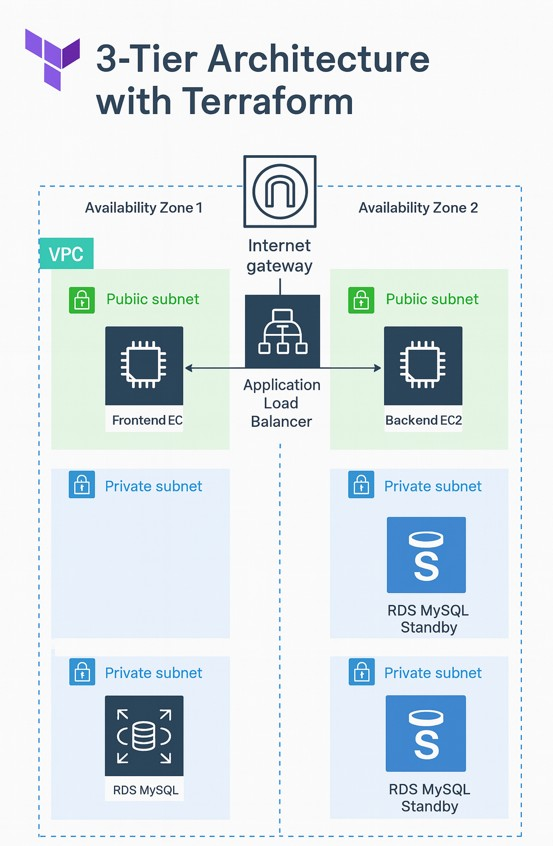
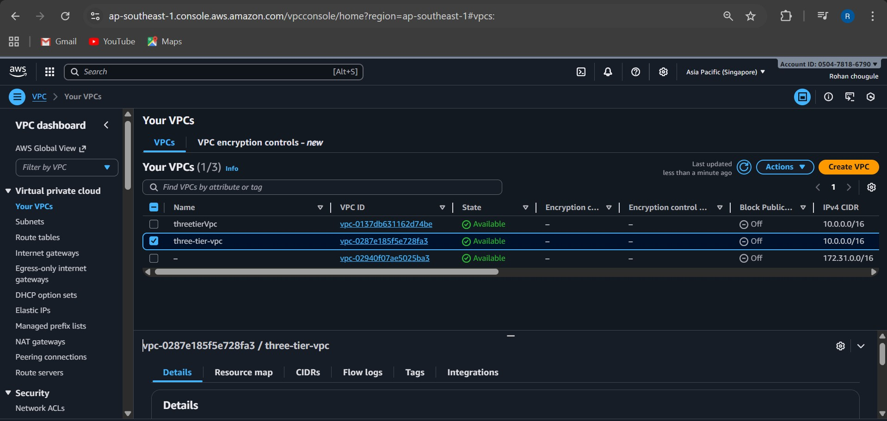
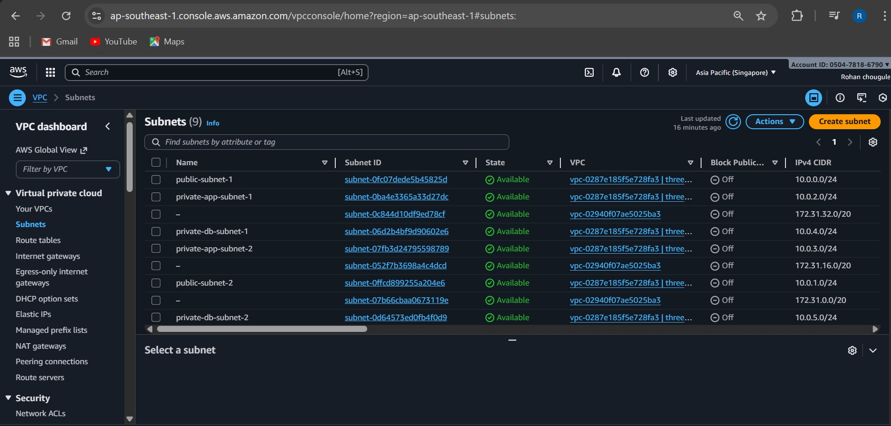
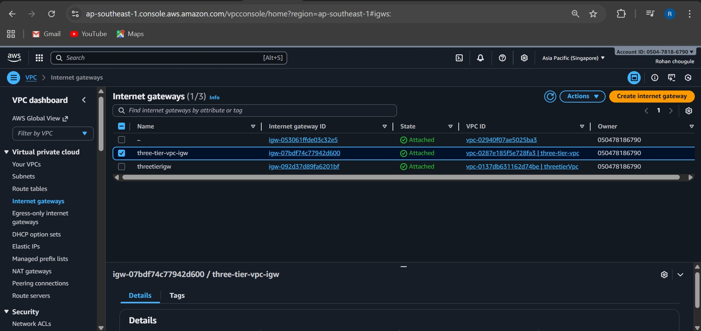
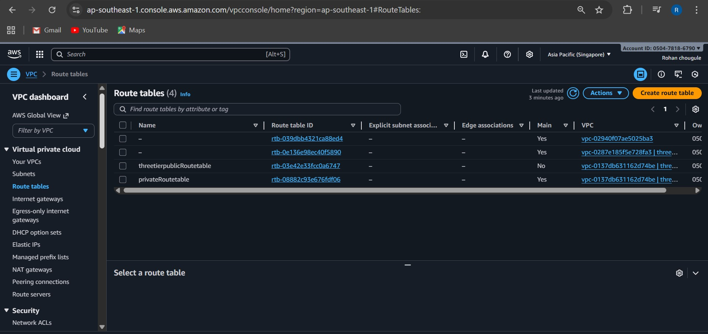
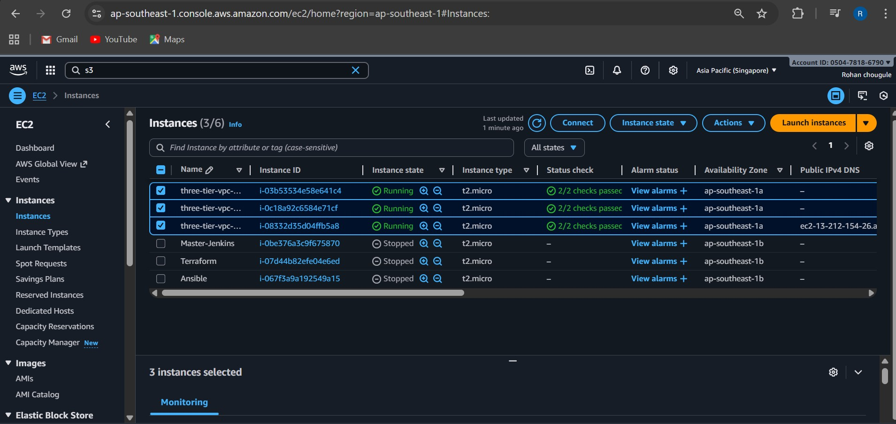
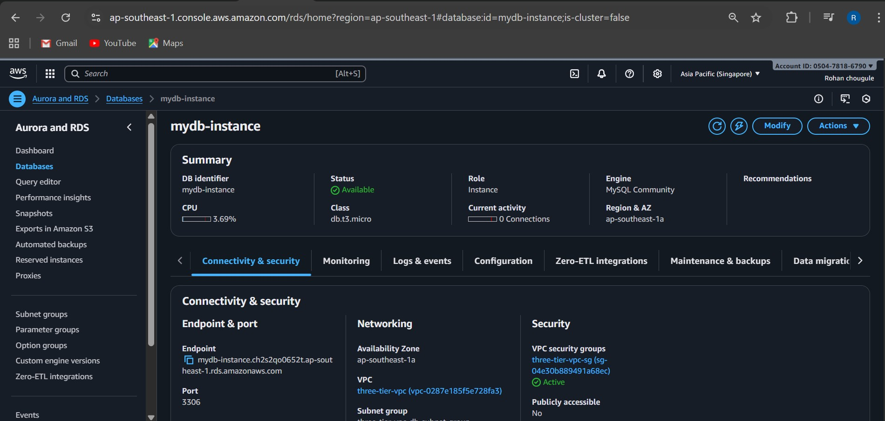
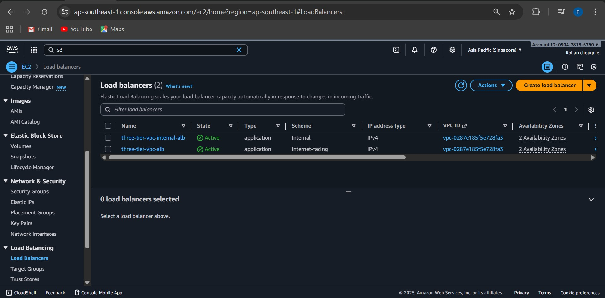
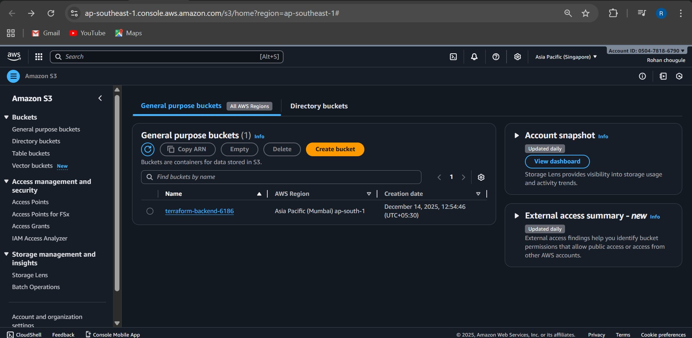
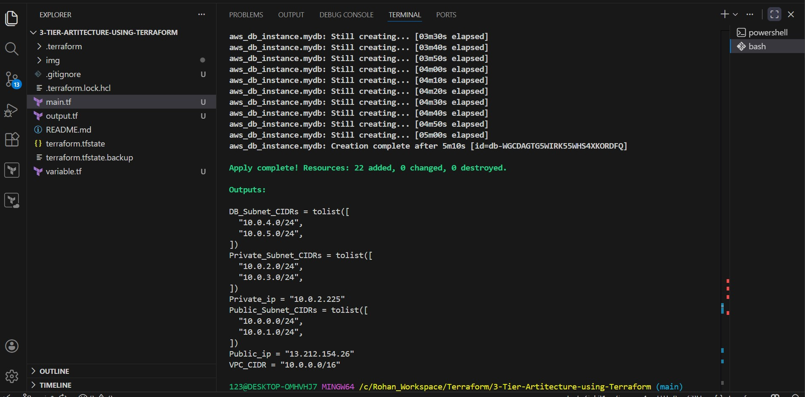

# 🌐 AWS 3‑Tier Infrastructure Automation with Terraform
A complete, production-ready 3-tier cloud infrastructure built with Terraform on AWS, including:
* 🟦 Public tier → Frontend EC2
* 🟩 Private tier → Backend EC2
* 🟨 Data tier → RDS MySQL (private) 

This project demonstrates industry-standard cloud architecture, infrastructure automation, and secure network design.

---

### 🧱 Architecture Overview




---
**What We Built**  
Here is everything we deployed using Terraform:

---
### 1. VPC (Virtual Private Cloud)
Resource: `aws_vpc.vpc`

Your entire cloud network — a secure boundary for frontend, backend, and database tiers.



---
### 2. Subnets
🟦 **Public Subnet → Frontend**   
Resource: `aws_subnet.pub-sub`
Used to host the frontend EC2 that needs internet access.

🟩 **Private Subnet 1 → Backend (App)**  
Resource: `aws_subnet.pvt-sub1`
Backend EC2 is isolated and reachable only from the frontend.

🟨 **Private Subnet 2 → Database (db)**  
Resource: `aws_subnet.pvt-sub2`
RDS stays private—cannot be accessed from internet.



---
### 3. Internet Gateway (IGW)
Resource: `aws_internet_gateway.igw`

Allows internet traffic for public resources.



---

### 4. Route Tables
**Public Route Table**   
Resource: `aws_default_route_table.main-rt`  
Routes → **Internet Gateway**

**Private Route Table**  
Resource: `aws_route_table.private_rt`

Subnet associations ensure traffic flows correctly.



---
### 5. Security Groups
🔵 **Frontend SG**  
Allows HTTP (80) + SSH (22) from anywhere.

🟢 **Backend SG**   
Allows app traffic only from frontend SG.

🟡 **Database SG**  
Allows MySQL traffic only from backend SG.

---
### 6. EC2 Instances
🟦 **Frontend EC2 (Public)**   
Resource: `aws_instance.public-server`   
Has public IP + accessible over HTTP.



🟩 **Backend EC2 (Private)**  
Resource: `aws_instance.private-app-server`   
Only frontend communicates with backend.


---
### 🗄️ 8. RDS MySQL Database
Resources:

* `aws_db_subnet_group.db-subnet`   
* `aws_db_instance.mydb`   

Private database with no public exposure.



---
### ⚖️ Load Balancer (ALB)
This project supports two types of Application Load Balancers controlled via Terraform variables.

🌍 **Public Application Load Balancer**
* Internet-facing ALB
* Deployed in public subnets
* Distributes HTTP traffic (port 80)
* Routes requests to the public EC2 instance     
 Enabled using:       
 `enable_alb = true`

**Components created:**
* `aws_lb.app_alb`
* `aws_lb_target_group.app_tg`
* `aws_lb_listener.app_listener`
* `aws_lb_target_group_attachment`
* `attach_public_instance`



---
### 🔒 Internal Application Load Balancer
* Private ALB (not internet-facing)
* Deployed in private application subnets
* Used for internal service-to-service communication
*Routes traffic to the private app EC2 instance    
Enabled using:   
`enable_internal_alb = true`

**Components created:**
* `aws_lb.internal_alb`
* `aws_lb_target_group.internal_tg`
* `aws_lb_listener.internal_listener`
* `aws_lb_target_group_attachment.internal_attach`


---
### 🪣 S3 Backend (Terraform State)
Terraform state is stored securely in Amazon S3 to enable:
* Remote state management
* State locking
* Team collaboration
* Safer infrastructure changes  
📦 **S3 Bucket Details**

* Bucket Name: `terraform-backend-6186`
* Region: `ap-south-1`
* State File: `terraform.tfstate`



⚠️ The S3 bucket must be created manually before running terraform init.

---
### Final Outputs:



---

### Project Structure
```
terraform-project/
│── main.tf
│── variables.tf
│── outputs.tf
│── terraform.tfvars
│── README.md
```
### Deployment Guide

1️⃣ **Initialize Terraform**
```
terraform init
```
2️⃣ **Validate**
```
terraform validate
```
3️⃣ **Plan**
```
terraform plan
```
4️⃣ **Apply**
```
terraform apply -auto-approve
```
5️⃣ **Destroy (Cleanup)**
```
terraform destroy -auto-approve
```
---
### Final Thoughts
This project is a complete, real-world cloud deployment.
You now understand:
* How enterprises design secure multi-tier apps
* How Terraform automates AWS cloud infrastructure
* How to build robust, scalable architectures 

This repository is a perfect portfolio project for Cloud, DevOps, and AWS roles.

---

